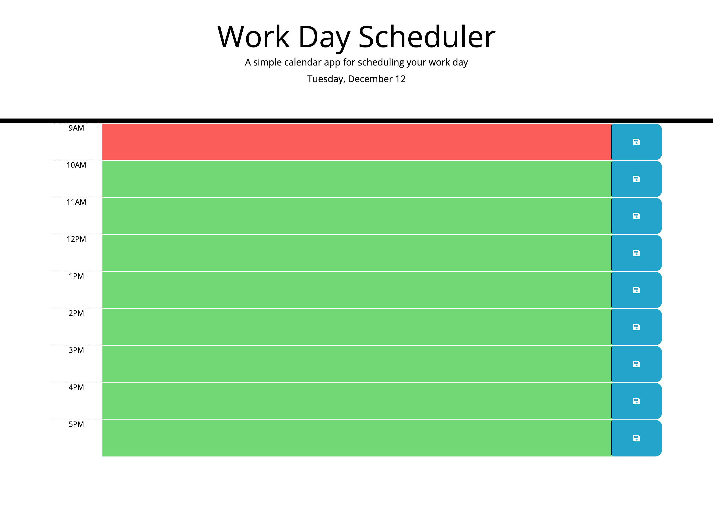

# rupesh-planner-app
This is a calendar planner application that allows users to save events for each hour of the day.

## Description

This project was created to develop an application that allows users to save events for each hour of the day, based on the following criteria:

- Upon opening the planner, the user will be able to see the current day, enabling them to plan accordingly.

- As the user scrolls down the page, they will be provided with the present time-block for standard business hours.

- Each time-block will be displayed in a color code, representing past, present, and future time.

- When the user clicks on a time-block, they can enter an event and also save it in the local storage by clicking the save button.

These app helps user to save events for each hour of the day.
The main things I have learned from this project are how to use local storage, jQuery, Web API and Third party API.

[Link to my deployed web page](https://rrana5106.github.io/rupesh-planner-app/)

## Installation
N/A

## Usage
Below is a screenshot of the published webpage:

## Credits
N/A

## License
N/A
